## Applications

次に 各ホスト・ノードや Kubernertesなどで稼働する アプリケーションについて、見ていきます。
Instanaの右のメニューから、**アプリケーション**のアイコンをクリックしてください。
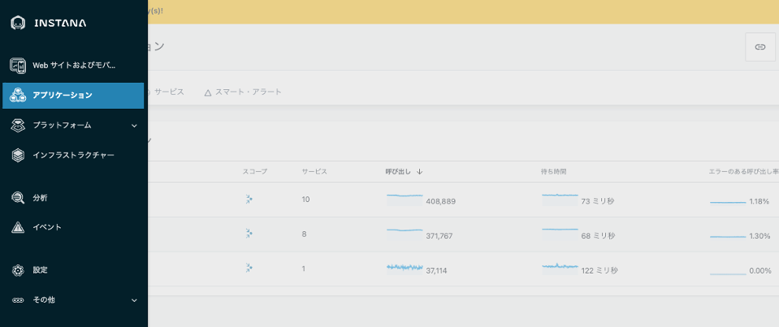
---
### マイクロサービスの可視化

1. **アプリケーション**と **サービス**の２つのタブがありますが、まずは**サービス**から見ていきます。  
ここには、Instanaのエージェントが検知したアプリケーション・サービスがリストされています。  
各行に、個々のサービスのテクノロジーやそのタイプ（HTTPやDATABASE, MESSAGINGなど）、および 各サービスのゴールデン・シグナル（呼び出し数、待ち時間、エラーのある呼び出し率）が表示されています。  
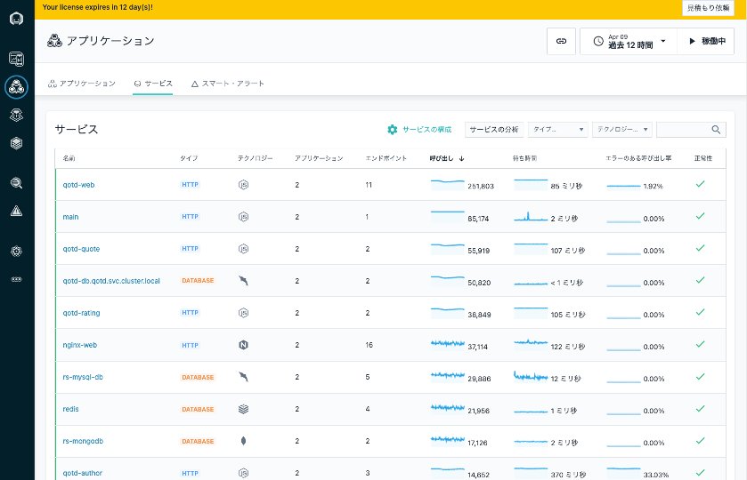

1. これらのゴールデン・シグナルに対して、機械学習を適用していますので、呼び出し数の急減や応答性能の遅延、エラー率の急増といったイベントを検知して、画面の右端にて正常性(緑色のレ点や黄色い△など）を表示しています。  
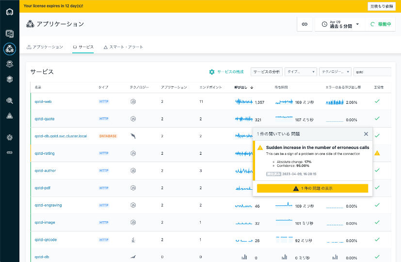
これらの問題の解析は、いったん後にして、もう少し画面を見ていきましょう。

1. つぎに **アプリケーション**のタブを開きましょう。
さきほどの サービス タブは、テクノロジーのリストであり、業務ユーザーにとっては意味をなしません。検知されたテクノロージを、ユーザーにとって意味のある体系に整理するビューが**アプリケーション**です。  

たとえば、特定のアプリケーション(QOTD)に特化したダッシュボードや、ネットショップ(RobotShop)全体のサービスを確認するビューです。また、DB管理者には、稼働するDatabaseすべてを含むビューが必要かもしません。
特定のノードで稼働するアプリケーション、特定の名前空間で稼働するアプリケーション、特定のサービスの下流にあるアプリケーションなど、このアプリケーション・タブは、ユーザーにとって管理しやすいよう、自由に定義・編集が可能です。
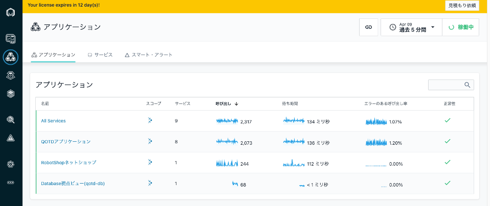

1. **QOTDアプリケーション**のアプリケーションビューをクリックしましょう。  
QOTDアプリケーション を構成するマイクロサービス全体の**サマリー**のダッシュボードが開きます。一番上には、ゴールデン・シグナル（呼び出し数、エラーのある呼び出し率、待ち時間）およびその履歴が表示されています。  
下には関連する基盤で発生したインフラストラクチャーの問題および変更、各ゴールデンシグナルでのサービスのランキング、および処理時間が表示されています。
下段中央の トップ・サービスでは、応答が悪化しているサービスやエラー数が多いサービスを確認できますので、特に注視が必要なものが分かります。呼び出し、エラーのある呼び出し率、待ち時間を選択し表示を切り替えてみてください。
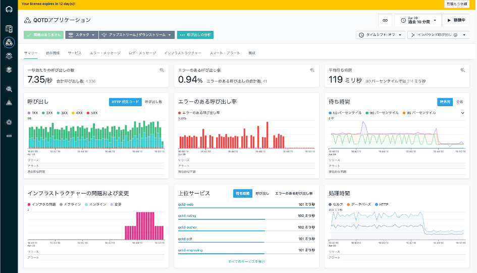
1. 次に **依存関係**のタブを開きましょう。ここでは QOTDアプリケーションを構成する様々なサービスの依存関係（コンテキスト）が可視化されています。動いている一つ一つの点が サービス間の要求です。  
Instanaは、これらの要求を解析することで、依存関係をダイナミックに可視化しています。もし色が付いているサービスがあれば、それは問題が発生しているサービスです。
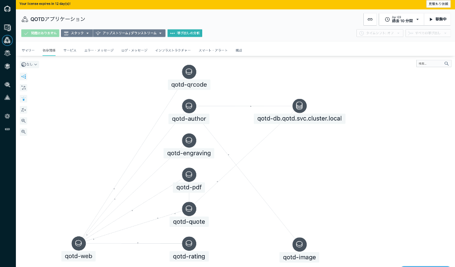
1. ひとつのサービスにカーソルを合わせて見ましょう。そのサービスと依存関係のあるサービスのみにフォーカスが当たります。
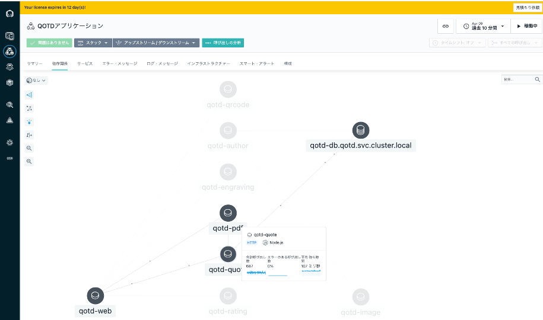
1. 左上の メニューを選択することで、応答性能が遅いサービスのアイコンを大きくしたり、要求数の大きいサービスを大きくしたり、わかりやすく可視化できますので、いろいろ触ってみてください。　　
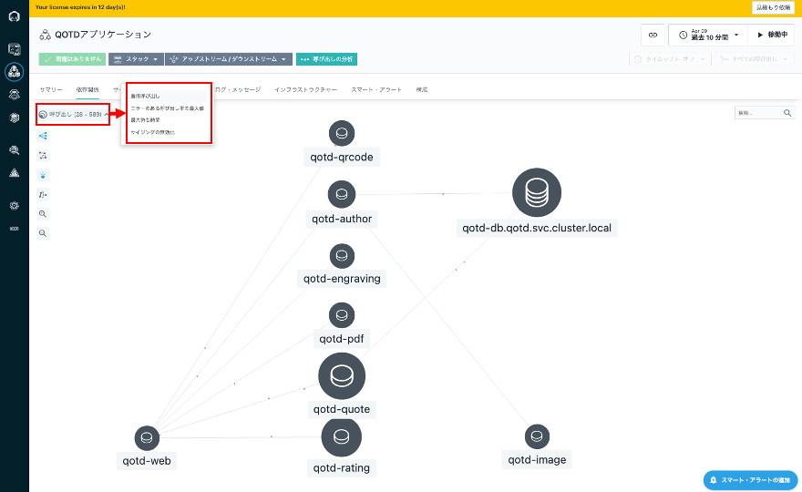
1. たとえば、Databaseのサービスを選んで、サービスのダッシュボードに移動してみましょう。  
どれでもいいですが、以下の例では、**qotd-db.qotd.svc.cluster.local**という MySQLのサービスを開きます。
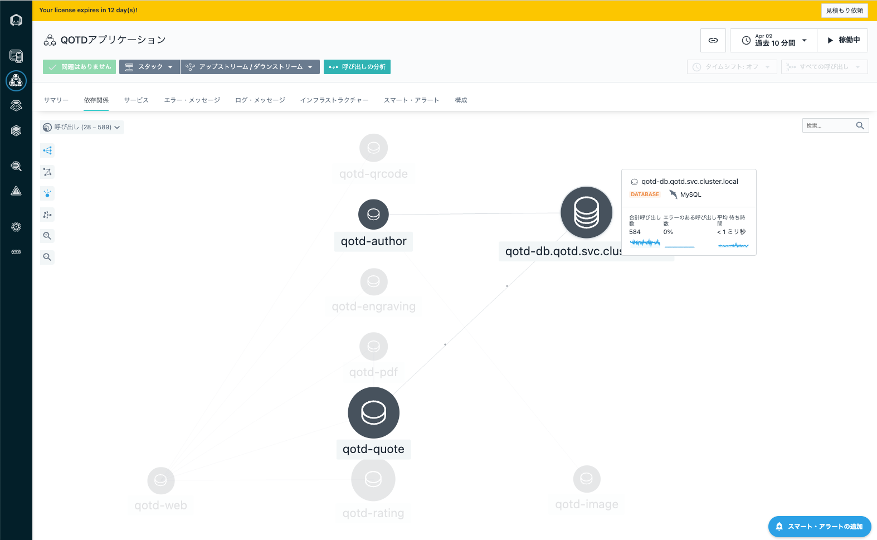
1. 開くと、rs-mysql-dbサービスの詳細が表示されています。右下には、応答時間がかかっているSQLが順に表示されています。
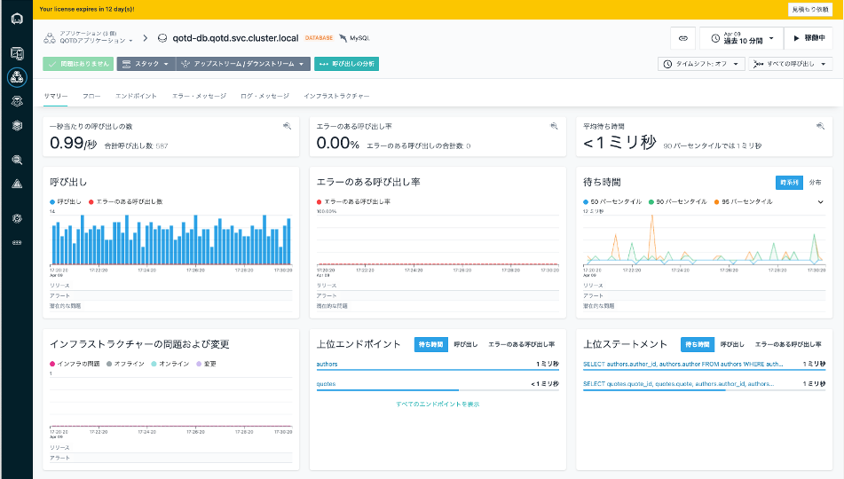
 
---
### アプリケーションの問題切り分け

1. **QOTDアプリケーション**の**サマリー**のダッシュボードに戻ります。
エラーとなっているコールがありますので、ここを確認していきましょう。  
もしエラーがない状況でしたら、右上のボタンで表示時間を１時間や６時間、１２時間などに広げてみてください。  
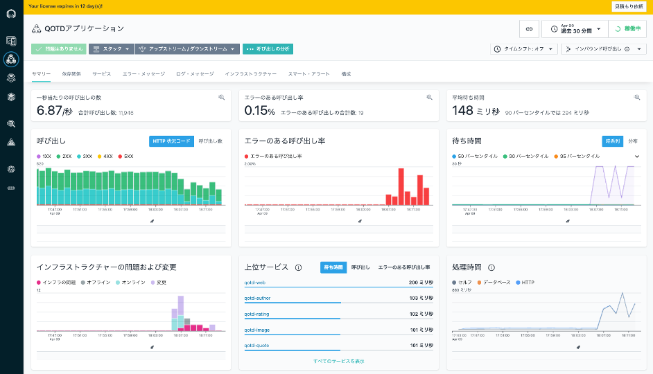
1. 中央の**エラーのある呼び出し率**のグラフの山をマウスで時間帯でクリックしながら領域選択すると表示される**虫眼鏡のアイコン**をクリックして分析画面に遷移して確認していきます。  
タイミングによって、起きているエラーは異なりますので、みなさんの画面で確認しているエラーを選択して開いて下さい。
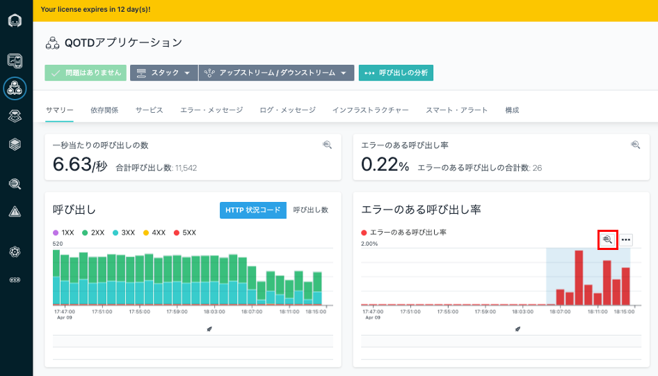
1. ここでは、**qotd-web**でエラーが発生しています。詳細を確認するために**qotd-web**を選択します。  
タイミングによって起きているエラーは異なりますので、環境に応じて 一番多いエラーを選択して開いて下さい。
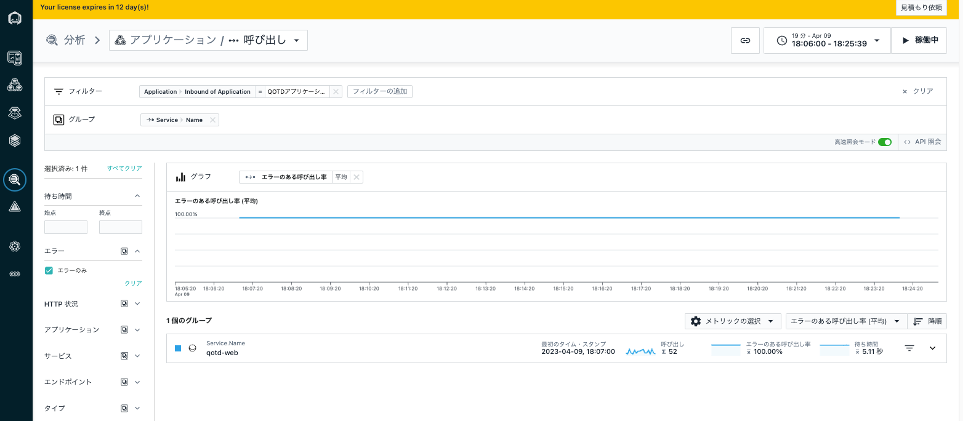
1. ここでは、エラーを返している **qotd-web**の要求がリストされています。  
軒並み応答性能が5000ミリ秒を超えてエラーとなっているようですね。これらについて詳細を確認していきましょう。  
一番上のエラー要求をクリックして、要求の中身をみていきます。
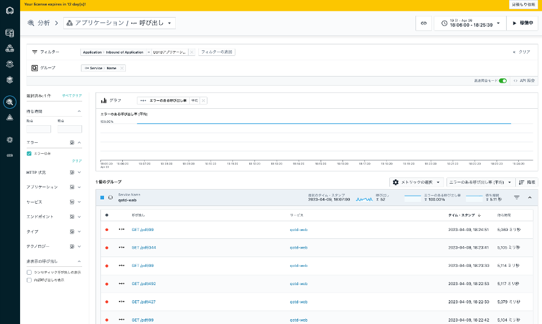
1. この `GET /pdf/99`要求の詳細がわかります。中身を確認しながらスクロールダウンしてください。
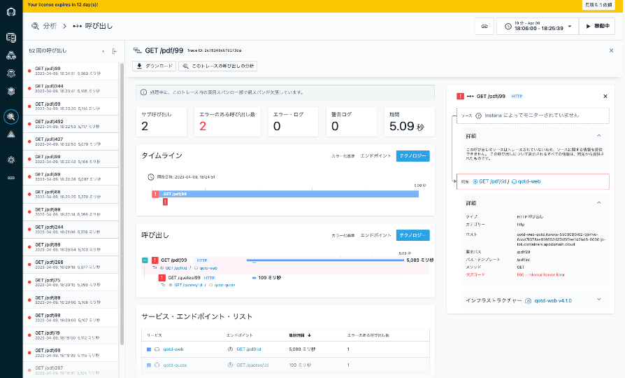
1. タイムラインのビューでは、この要求に関連して実行された マイクロサービスの呼び出し関係が可視化されています。

1. さらにスクロールダウンしていくと、コールのビューでは、各マイクロサービスの呼び出しの依存関係 呼び出し元と呼び出し先が確認できます。

1. マイクロサービスの一番下で、DATABASE（MySQLサービス）への CONNECT要求が5000ミリ秒でタイム・アウトし、エラーなっているのが分かります。
右のペーンには、エラーの内容と、問題が発生したコードのスタックトレースが表示されています。

1. 問題となっている MySQLサービスをクリックすると、当該時間帯に Offlineが検知されているのが分かります。

このようなかたちで、エラー応答となったマイクロサービスの依存関係を解析した上で、問題の根本原因の分析へと絞り込んでいくことが可能です。

---
ここまでで、サーバー側のマイクロサービスの挙動を理解するための**Applications**の確認は終了です。  
次に、ブラウザやモバイル・アプリケーションなど、エンドユーザー側の挙動をみる [WebSites & MobileApps](WebSites%26MobileApps.md)をみていきます。
